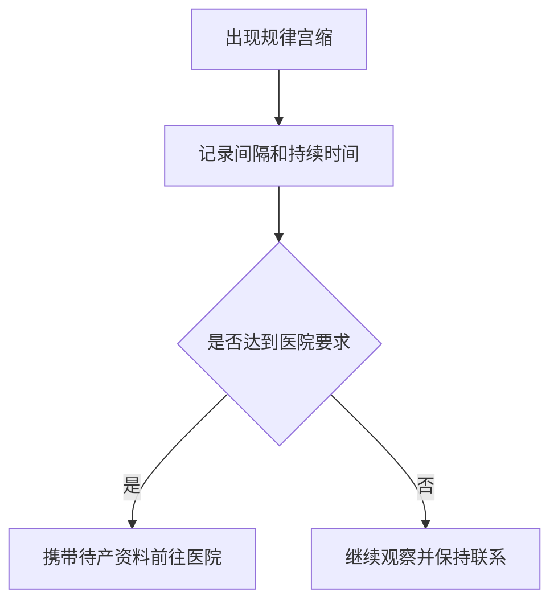

# AGENTS.md

## 1. 项目名称

家庭迎新生命操作手册（Family New Life Handbook）

## 2. 项目定位

本仓库是一个长期维护、Git 管理、Markdown 驱动的家庭知识库项目。

它不是普通育儿百科，也不是一次性生成的长篇文档，而是一套面向真实家庭场景的操作手册，重点服务于：

- 第一次生产的家庭
- 家庭主要照顾者只有夫妻两人
- 爸爸承担主要协调、护理、记录与沟通职责
- 护工为一对多，只作为辅助
- 从孕晚期持续维护到宝宝 1 岁

Markdown 是唯一内容源文件。PDF、Word 等仅为发布产物。

---

## 3. Agent 角色

在本仓库中工作的 AI Agent，应根据任务承担以下一种或多种角色：

### 3.1 文档架构师

负责：

- 维护目录结构
- 拆分章节边界
- 避免模块职责重叠
- 维护跨章节导航
- 保证长期可维护性

### 3.2 内容工程师

负责：

- 按指定范围编写 Markdown
- 采用 SOP、Checklist、流程图等结构
- 保持术语、格式、标题风格一致
- 不修改未要求的章节

### 3.3 医学内容核验助手

负责：

- 标记医学风险内容
- 区分一般护理建议与医疗建议
- 避免无依据结论
- 对不确定内容标注“需医生确认”
- 优先使用权威、可追溯的信息来源

### 3.4 文档质量审查员

负责：

- 检查重复内容
- 检查死链和错误导航
- 检查标题层级
- 检查 Checklist 是否可执行
- 检查 Mermaid 是否可渲染
- 检查医学内容是否越界

---

## 4. 当前仓库结构

```text
.
├── README.md
├── AGENTS.md
├── CLAUDE.md
├── assets/
│   ├── diagrams/
│   ├── flowcharts/
│   └── images/
├── docs/
│   ├── 00-project/
│   ├── 01-late-pregnancy/
│   ├── 02-labor-day/
│   ├── 03-hospital-stay/
│   ├── 04-mother-recovery/
│   ├── 05-newborn-care/
│   ├── 06-dad-guide/
│   ├── 07-postpartum-42-days/
│   └── 08-first-year/
├── templates/
└── release/
    ├── pdf/
    └── docx/
```

目录职责以 `docs/00-project/module-overview.md` 为准。

---

## 5. 强制工作规则

### 5.1 先读后改

开始任务前，至少检查：

1. 根目录 `README.md`
2. `docs/00-project/project-overview.md`
3. `docs/00-project/writing-standard.md`
4. 当前模块的 `README.md`
5. 任务相关章节

不得在不了解现有规范时直接批量生成内容。

### 5.2 严格控制修改范围

仅修改用户明确要求的文件。

禁止：

- 顺手重构无关目录
- 批量改写未评审章节
- 擅自增加新卷
- 擅自调整已确认命名
- 覆盖用户已有记录

### 5.3 目录变更需先说明

以下操作必须先输出变更方案，不得直接落盘：

- 新增一级模块
- 删除或合并模块
- 批量重命名文件
- 改变 day-01 至 day-42 结构
- 改变 month-01 至 month-12 结构
- 调整模板统一结构

### 5.4 小步提交

优先采用以下粒度：

- 一次只完成一个模块目录
- 一次只编写 1–3 个相关章节
- 一次只做一种类型的规范修改
- 医学内容与纯结构修改尽量分开

禁止一次性生成数百页正文。

---

## 6. Markdown 章节规范

业务章节默认使用以下结构：

```markdown
# 标题

## 本章目标

## 为什么重要

## 时间节点

## 操作流程

## 注意事项

## 常见错误

## 医疗风险提醒

## Checklist

- [ ]

## 记录区域
```

可根据章节需要增加：

- `## 适用场景`
- `## 不适用场景`
- `## 真实场景模拟`
- `## 医生常用术语`
- `## 一页速查`
- `## 参考来源`

但不得删除核心章节，除非写作规范明确允许。

---

## 7. 内容写作要求

内容必须：

- 使用简体中文
- 面向中国家庭实际场景
- 可执行、可检查、可打印
- 优先使用短段落、步骤、表格和 Checklist
- 明确爸爸、妈妈、医生、护士、护工的职责边界
- 区分顺产、剖宫产、住院和居家场景
- 对紧急情况给出清晰升级路径

内容避免：

- 空泛安慰
- 夸张营销语言
- 大段百科式复制
- 不必要的专业术语
- 将个体经验写成普遍医学结论
- 绝对化用语，如“肯定”“一定没事”“必须这样做”

---

## 8. 医学安全规则

### 8.1 内容分级

医学相关内容应尽量分为：

- 日常观察
- 建议咨询医生
- 尽快就医
- 立即急诊或呼叫急救

### 8.2 禁止事项

禁止：

- 远程诊断具体疾病
- 擅自建议停药、换药或加药
- 给出不安全剂量
- 用单一症状排除严重疾病
- 将家庭护理替代正规诊疗
- 编造检查标准、风险概率或医院政策

### 8.3 个性化家庭信息

可在项目配置或专门章节中记录以下长期有效背景：

- 城市：杭州
- 夫妻二人为主要家庭成员
- 爸爸为主要陪护与协调者
- 护工为一对多
- 妈妈孕期存在需持续关注的既往检查情况

敏感医疗细节不得在无必要情况下扩散到所有章节。

---

## 9. Mermaid 规则

- Mermaid 仅用于流程、角色关系和决策路径
- 节点文字尽量简短
- 紧急路径必须显式标出
- 一个图只表达一个核心流程
- 不使用过度复杂的交叉线
- 修改后检查代码块闭合与语法

示例：



---

## 10. Checklist 规则

Checklist 必须：

- 一个勾选项只描述一个动作
- 使用动词开头
- 可明确判断是否完成
- 避免“注意安全”这类不可验证描述

推荐：

```markdown
- [ ] 将身份证和医保卡放入证件袋
- [ ] 保存产科急诊联系电话
```

不推荐：

```markdown
- [ ] 做好准备
- [ ] 注意情况
```

---

## 11. Git 和提交规范

建议 Commit Message：

```text
docs: add late pregnancy chapter skeleton
docs: write labor admission checklist
docs: refine newborn feeding record
chore: add markdown lint configuration
fix: repair broken chapter navigation
```

每次提交应说明：

- 修改目的
- 修改文件
- 是否涉及医学内容
- 是否需要人工复核

不得自动执行：

- `git push`
- 创建 PR
- 合并分支
- 删除用户分支

除非用户明确要求。

---
## 12. Prompt 执行记录规范

本项目采用 Prompt 驱动开发模式。

所有 AI Agent（Codex、Claude Code、ChatGPT 等）执行的： - 项目初始化 -
文件创建 - 批量内容生成 - 文件修改 - 目录调整

都必须记录对应 Prompt 来源。

## 记录文件

统一维护：

    docs/00-project/prompt-history.md

## 必须记录的信息

每次 Prompt 执行记录：

-   执行时间
-   使用 Agent
-   Prompt 文件名称
-   Prompt 版本
-   执行动作
-   创建文件列表
-   修改文件列表
-   删除文件列表
-   审核状态

## 示例

``` markdown
## 2026-07-22

### Prompt
Codex_Prompt_家庭迎新生命操作手册初始化_V2.0.md

### Agent
Codex

### 操作
初始化项目工程骨架

### 创建文件
- README.md
- docs/00-project/project-overview.md

### 审核状态
已审核
```

## 约束

-   大批量生成文件必须记录 Prompt。
-   修改已有内容必须记录原因。
-   多个 Prompt 修改同一文件时，需要追加记录。
---

## 13. 完成任务后的输出

完成后应汇报：

1. 本次完成内容
2. 修改文件列表
3. 关键设计决策
4. 需要人工确认的医学内容
5. 未完成或暂缓内容
6. 建议的下一步

不得只说“已完成”。

---

## 14. 当前阶段

当前项目已完成 V2.0 工程骨架初始化。

下一阶段建议：

1. 评审第一卷至第六卷的章节清单
2. 确认每个章节的英文文件名
3. 建立信息来源与医学核验规范
4. 按卷、小批量生成正文
5. 最后再建立 PDF、Word 发布流程

---

## 15. AI 文档工程治理

### 15.1 执行前阅读顺序

涉及 Prompt 驱动的创建、修改、迁移或治理任务时，按以下顺序恢复上下文：

1. `README.md`
2. `docs/00-project/project-context.md`
3. `prompts/README.md`
4. `prompts/prompt-index.md`
5. `docs/00-project/prompt-history.md`
6. `docs/00-project/project-overview.md`
7. `docs/00-project/writing-standard.md`
8. `docs/00-project/module-overview.md`
9. `AGENTS.md`
10. `CLAUDE.md`
11. `docs/00-project/decision-records/`

### 15.2 Prompt 与结果分离

- Prompt 只存放在 `prompts/` 的对应分类目录。
- 最终 Markdown 结果存放在 `docs/`。
- 项目治理信息存放在 `docs/00-project/`。
- Prompt 不得与最终文档、图片或发布产物混放。

### 15.3 执行记录

- 每次执行 Prompt 后必须更新 `docs/00-project/prompt-history.md`。
- 创建、修改、删除和迁移文件必须记录具体路径，不能只记录文件数量。
- 连续编号文件可使用明确的起止范围，但必须同时记录范围和文件数量。
- 未执行 Git commit 时必须明确记录“未执行”，不能留下可能被误解的空值。

### 15.4 阶段状态维护

- 每次阶段切换或重大任务完成后必须更新 `docs/00-project/project-context.md`。
- 新终端或新 Agent 开始工作前，先确认当前阶段、当前任务和下一步。
- 不得因缺少会话上下文重新初始化项目。

---

## 16. Frozen 工程结构保护

执行任何任务前必须检查根目录 `STATUS.md`。

如果 `STATUS.md` 显示：

```text
Phase Status = Frozen
```

则禁止 Agent 主动修改工程结构，包括目录层级、治理体系和 Prompt 生命周期。

冻结后仅允许：

- 新增 Prompt
- 新增内容
- 修复 Bug

只有用户明确要求修改冻结结构时才可继续；执行前必须说明影响范围，并新增或更新 ADR 记录该决策。
