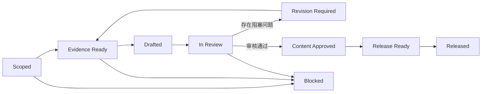
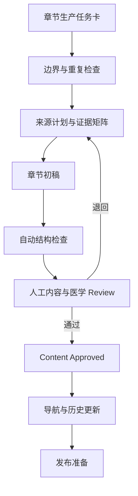
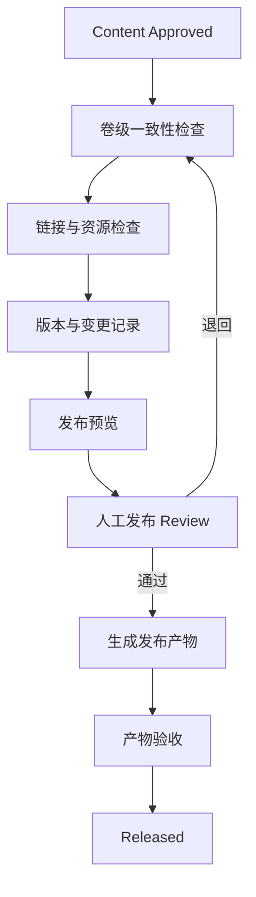

# Content Production Framework

Version：V1.0

适用范围：PR-012～PR-090，以及本项目八卷业务内容的编写、审核和发布准备。

生效条件：PR-011 完成人工 Review，并在 Prompt Index 中标记为 `Approved`。

## 1. 文档定位

本文件是《家庭迎新生命操作手册》的项目级内容生产规范，统一管理：

- Content Production Framework
- Writing Handbook
- Medical Reference Handbook
- Style Guide
- Review Handbook
- Release Handbook

后续内容 Prompt 必须直接引用本文件，不再重新设计内容生产流程、正文模板、医学引用规则、Review 标准或发布规则。

本文件只定义内容工程规则，不包含任何孕产、护理、育儿或医学正文。

## 2. 规则优先级

发生规则冲突时，按以下顺序处理：

1. 用户当前明确指令
2. `AGENTS.md`
3. `CLAUDE.md`
4. 本文件
5. `docs/00-project/writing-standard.md`
6. 模块 `README.md`
7. 章节现有约定

本文件细化既有规则，不修改 Prompt 生命周期、工程目录职责或 PR 编号体系。

如果高优先级规则与本文件存在无法兼容的实质冲突，停止生成受影响内容，向用户报告冲突，不自行选择宽松解释。

## 3. 核心原则

所有业务内容必须同时满足：

- 面向第一次迎接新生命的中国家庭。
- 以爸爸协作和家庭执行为重点，不把照护责任单方面转移给妈妈。
- Markdown 是唯一源文件。
- 先确定边界和来源，再写正文。
- 操作步骤优先于百科式解释。
- 医学事实可追溯，医学边界明确。
- 危险信号必须给出清晰升级路径。
- 不把家庭手册写成诊断、处方或治疗方案。
- 不制造焦虑，不用绝对化承诺。
- 一次内容 PR 原则上只处理一个章节或 1～3 个高度相关章节。
- 未通过 Review 的内容不得进入发布准备。

## 4. Framework Contract

### 4.1 后续内容 PR 的必备输入

每个 PR-012～PR-090 在执行前必须提供：

| 输入 | 最低要求 |
| --- | --- |
| 目标卷 | 明确 Volume 和模块目录 |
| 目标章节 | 明确文件路径、章节标题和范围 |
| 内容边界 | 明确包含内容与不包含内容 |
| 目标读者 | 默认是第一次当爸爸的中国家庭 |
| 时间范围 | 明确孕周、生产阶段、产后天数或宝宝月龄 |
| 角色范围 | 明确爸爸、妈妈、医生、护士、护工的职责 |
| 风险等级 | 按 L0～L3 评估 |
| 来源计划 | 列出准备使用的来源 ID 或来源补充方案 |
| 保护范围 | 列出不得修改的文件和目录 |
| 验收方式 | 明确自动检查和人工 Review 项目 |

缺少目标章节、内容边界、风险等级或来源计划时，不得开始正文生成。

### 4.2 后续内容 PR 的标准输出

每个内容 PR 至少输出：

- 在授权范围内新增或修改的 Markdown 文件。
- 章节使用的来源 ID 清单。
- Review 结果。
- 实际文件映射。
- 验收命令和结果。
- 未解决的阻塞项；不存在阻塞时明确写“无”。

### 4.3 一票否决条件

出现以下任一情况，内容不得标记为 Approved：

- 医学主张没有可追溯来源。
- 使用失效、无法确认版本或明显不适用的来源支撑高风险结论。
- 把一般信息写成个体化诊断或治疗建议。
- 给出停药、换药、加药或具体剂量建议。
- 危险信号没有明确的就医升级动作。
- 章节边界与其他卷严重重叠且没有交叉引用。
- Checklist 无法判断是否完成。
- 存在未解释的占位内容、断链或无法渲染的关键 Mermaid 图。
- AI 生成了无法从来源验证的数字、概率、检查标准或医院政策。

## 5. 内容状态模型

内容状态与 Prompt Status 分开维护，不修改 `Draft`、`Testing`、`Approved`、`Reserved`、`Archived`、`Deprecated` 的 Prompt 生命周期。

| 内容状态 | 含义 | 进入条件 |
| --- | --- | --- |
| Scoped | 章节范围已确定 | 任务卡完整 |
| Evidence Ready | 来源计划已通过检查 | 证据矩阵完整，高风险来源有效 |
| Drafted | 初稿完成 | 固定章节结构完整 |
| In Review | 正在审核 | 自动检查通过 |
| Revision Required | 必须修订 | Review 发现阻塞问题 |
| Content Approved | 内容通过审核 | 所有强制 Review 项通过 |
| Release Ready | 可进入发布准备 | 导航、版本和发布材料完整 |
| Released | 已纳入发布版本 | 发布流程完成 |
| Blocked | 无法继续 | 来源冲突、授权不足或外部条件缺失 |

状态流：



## 6. Content Flow

### 6.1 标准流程

1. 读取项目治理文档和目标模块 README。
2. 填写章节生产任务卡。
3. 检查章节边界和跨卷重复。
4. 评估 L0～L3 风险等级。
5. 建立医学证据矩阵。
6. 验证来源 URL、版本、发布日期和适用范围。
7. 按固定章节模板生成初稿。
8. 执行结构、链接、引用、Mermaid 和占位符检查。
9. 执行内容、医学、可执行性和风格 Review。
10. 修订所有阻塞问题。
11. 完成人工 Review。
12. 更新模块导航和执行历史。
13. 满足发布条件后进入 Release Flow。

### 6.2 内容数据流



### 6.3 阻塞处理

| 情况 | 处理方式 |
| --- | --- |
| 来源页面失效 | 在同一发布机构官网查找新版或存档；无法确认时停止使用该主张 |
| 来源版本不明 | 不支撑 L2、L3 内容，返回证据补充 |
| 中国与国际指南冲突 | 优先适用中国现行规范，并在证据矩阵记录差异 |
| 两份中国权威来源冲突 | 优先更新、更具体、层级更高的来源；仍无法判断时标记 Blocked |
| 医院流程不统一 | 使用“需与建档医院确认”，不得写成全国统一流程 |
| 家庭个案超出通用范围 | 转为与医生沟通的问题清单，不给出个体化结论 |
| 授权范围不足 | 停止修改未授权文件并报告 |

## 7. Volume Flow

### 7.1 八卷顺序与边界

| Volume | 模块 | 主要内容阶段 | 与相邻卷的交接点 |
| --- | --- | --- | --- |
| Volume 01 | 孕晚期准备 | 孕晚期至临产前 | 出现临产信号后进入 Volume 02 |
| Volume 02 | 生产当天 | 临产开始至宝宝出生 | 入院后持续记录，产后进入 Volume 03 |
| Volume 03 | 医院住院 | 入院后至出院前 | 妈妈恢复转 Volume 04，宝宝护理转 Volume 05 |
| Volume 04 | 妈妈恢复 | 产后妈妈恢复支持 | 日常协作引用 Volume 06 和 Volume 07 |
| Volume 05 | 新生儿护理 | 新生儿基础照护与观察 | 家庭分工引用 Volume 06，逐日执行转 Volume 07 |
| Volume 06 | 爸爸指南 | 协作、沟通、记录与安排 | 不重复 Volume 01～05 的具体医疗和护理流程 |
| Volume 07 | 月子 42 天 | 产后 42 天逐日任务 | 42 天后持续成长管理转 Volume 08 |
| Volume 08 | 0～1 岁 | 宝宝第一年逐月管理 | 以月龄阶段索引和记录为主 |

### 7.2 卷级生产顺序

每一卷按以下顺序生产：

1. 确认卷级目标和退出条件。
2. 审核章节清单与边界。
3. 为每章建立任务卡和来源计划。
4. 每次编写 1～3 个高度相关章节。
5. 通过单章 Review。
6. 执行卷内术语、导航和重复内容检查。
7. 执行跨卷边界检查。
8. 完成卷级人工 Review。
9. 标记为 Release Ready。

不得因一个章节通过 Review 而提前宣布整卷完成。

## 8. Writing Handbook

### 8.1 固定章节结构

业务章节必须保留以下核心二级标题：

```markdown
# {{TITLE}}

## 本章目标

## 为什么重要

## 时间节点

## 操作流程

## 注意事项

## 常见错误

## 医疗风险提醒

## Checklist

## 记录区域
```

模板变量使用双花括号表示结构字段，不属于未完成正文。正式章节不得保留未替换的模板变量。

### 8.2 可选扩展模块

根据章节职责，可以增加：

- `## 适用场景`
- `## 不适用场景`
- `## 爸爸行动项`
- `## 妈妈注意事项`
- `## 医学知识`
- `## 需要与医院确认`
- `## 常见问题`
- `## 真实场景模拟`
- `## 医生常用术语`
- `## 一页速查`
- `## 参考来源`

扩展模块按需使用，不得为了形式完整重复核心章节内容。

### 8.3 标题规范

- 每个文件只使用一个一级标题。
- 二级标题表达固定功能。
- 三级标题只拆分二级标题下的明确子任务。
- 不使用手工章节编号。
- 标题直接描述动作或主题，不使用营销式标题。
- 文件名与一级标题语义必须一致。

### 8.4 爸爸行动项

爸爸行动项必须：

- 使用动词开头。
- 明确时间、地点或触发条件。
- 明确需要联系的人或携带的资料。
- 能够判断是否完成。
- 不替代妈妈表达意愿或替代医务人员决策。

推荐格式：

```markdown
### 爸爸行动

1. 在 {{TRIGGER}} 时联系 {{CONTACT}}。
2. 携带 {{MATERIALS}}。
3. 记录 {{RECORD_FIELDS}}。
4. 将异常情况原样告知医生或护士。
```

### 8.5 妈妈注意事项

妈妈注意事项应聚焦：

- 妈妈需要表达的感受、意愿和症状。
- 需要保存体力或获得帮助的事项。
- 需要医务人员评估的变化。
- 爸爸和其他照护者应提供的支持。

不得以“妈妈必须独自完成”的方式转移家庭协作责任。

### 8.6 医学知识模块

医学知识模块只解释完成家庭行动所需的最小知识：

```markdown
### 医学知识

- 这是什么：{{PLAIN_LANGUAGE_DEFINITION}}
- 家庭需要观察什么：{{OBSERVABLE_SIGNS}}
- 何时咨询医生：{{CONSULT_TRIGGER}}
- 何时立即升级：{{EMERGENCY_TRIGGER}}
- 来源：{{SOURCE_IDS}}
```

不展开与家庭行动无关的病理机制、鉴别诊断或专业治疗方案。

### 8.7 操作步骤

SOP 使用有序列表，每一步只表达一个主要动作：

```markdown
1. 确认触发条件。
2. 准备所需物品或信息。
3. 执行动作。
4. 观察结果。
5. 记录时间和变化。
6. 根据升级条件联系医务人员。
```

包含判断分支时，优先使用简短表格或 Mermaid 流程图。

### 8.8 Checklist

Checklist 必须：

- 使用 `- [ ]`。
- 每项只描述一个动作。
- 使用动词开头。
- 可以明确判断完成或未完成。
- 必要时包含负责人和完成时间。
- 不使用“注意安全”“多观察”等不可验证表达。

推荐格式：

```markdown
- [ ] 动作：{{ACTION}}；负责人：{{OWNER}}；完成时间：{{TIME}}
```

### 8.9 FAQ

FAQ 只收录读者在执行时会实际遇到的问题：

```markdown
### {{QUESTION}}

直接回答：{{SHORT_ANSWER}}

行动建议：{{ACTION}}

升级条件：{{ESCALATION_IF_APPLICABLE}}

来源：{{SOURCE_IDS_IF_MEDICAL}}
```

不使用 FAQ 重复正文中的完整解释。

### 8.10 家庭记录

记录区域应根据任务选择字段：

| 字段类型 | 示例 |
| --- | --- |
| 时间 | 日期、开始时间、持续时间 |
| 观察 | 原样记录可见变化，不写诊断 |
| 行动 | 联系、就医、喂养、休息、物品准备 |
| 负责人 | 爸爸、妈妈、其他照护者 |
| 医务反馈 | 医生或护士原话摘要 |
| 后续安排 | 复诊、继续观察、再次联系条件 |

记录模板必须区分家庭观察与医务判断。

### 8.11 Mermaid

Mermaid 仅用于：

- 时间顺序
- 决策路径
- 角色协作
- 就医升级
- 跨卷交接

规则：

- 使用 `flowchart TD` 或 `flowchart LR`。
- 节点 ID 使用英文小写字母和数字。
- 一个图只表达一个核心流程。
- 节点文字保持简短。
- 紧急路径必须显式标注。
- 复杂说明放在图后正文。
- 修改后检查代码块闭合和渲染结果。

### 8.12 表格

- 表格必须有表头和分隔行。
- 单元格只放简短信息。
- 长段解释移到表格后。
- 不使用空格模拟表格。
- 不依赖合并单元格。
- 移动端或窄版打印时仍应能够理解。

### 8.13 风险提示

统一使用四级行动语言：

| 级别 | 表达 | 动作 |
| --- | --- | --- |
| 日常观察 | “记录并继续观察” | 家庭记录 |
| 建议咨询 | “联系建档医院、儿科或社区医务人员确认” | 非紧急专业咨询 |
| 尽快就医 | “尽快前往具备相应能力的医疗机构评估” | 当日或医务人员要求的时限 |
| 立即急救 | “立即呼叫 120 或按当地急救流程处理” | 不等待家庭护理见效 |

风险提示必须写清触发条件和动作，不使用颜色作为唯一信息载体。

## 9. Medical Reference Handbook

### 9.1 医学内容边界

本项目可以提供：

- 一般健康教育。
- 家庭可观察的现象。
- 日常照护和记录方法。
- 风险提示和就医升级路径。
- 与医生沟通的问题清单。

本项目不能提供：

- 远程诊断。
- 个体化处方。
- 停药、换药、加药建议。
- 未经权威来源支持的具体剂量。
- 用单一症状排除严重问题。
- 将家庭护理替代正规诊疗的建议。
- 对具体医院制度的无依据推断。

### 9.2 医学免责声明

包含医学信息的章节必须在首次风险内容附近或章节末使用以下统一声明：

> 本章用于家庭健康教育、行动准备和记录，不提供诊断或个体化治疗。用药、检查、分娩和护理方案应由具备资质的医务人员结合实际情况决定。出现危险信号时，应立即联系医疗机构或呼叫 120，不要等待家庭护理见效。

### 9.3 内容风险等级

| 等级 | 范围 | 来源与 Review 要求 |
| --- | --- | --- |
| L0 | 导航、纯记录结构、非医学项目管理 | 可不使用医学来源 |
| L1 | 一般生活安排、家庭协作、低风险照护 | 至少检查权威健康教育资料 |
| L2 | 检查、喂养、恢复、发育、接种等医学相关内容 | 至少一个 A/B 级中国来源；必要时增加 C 级国际来源 |
| L3 | 危险信号、急症、药物、可能延误诊疗的判断 | 至少一个 A/B 级适用来源和一个独立权威来源；必须人工医学 Review |

### 9.4 来源等级

| 等级 | 来源 | 使用方式 |
| --- | --- | --- |
| A | 中国法律法规、国家卫生健康委、国家疾控局及其直属机构现行文件 | 中国家庭场景的首选依据 |
| B | 中华医学会及其专业分会、国家或行业标准、权威中国专业指南 | 补充临床和专业细节 |
| C | WHO、NICE、CDC、AAP、ACOG 等国际权威指南 | 补充国际证据和中国规范未覆盖内容 |
| D | 系统综述、同行评审研究、药品说明书 | 只用于权威指南未覆盖的问题，不单独支撑家庭高风险行动 |

医院公众号、商业母婴平台、短视频、自媒体、论坛、问答网站和 AI 输出不能作为医学结论来源。

### 9.5 来源优先级

同一主题存在多个来源时，依次考虑：

1. 对中国家庭的适用性。
2. 发布机构层级。
3. 是否为现行版本。
4. 发布时间和最近更新日期。
5. 是否直接覆盖目标人群和场景。
6. 推荐强度和证据质量。
7. 是否可公开访问和长期追溯。

国际来源与中国规范冲突时，不直接用国际建议覆盖中国现行规范；应记录差异，并以中国规范和建档医院要求为执行基准。

### 9.6 来源 ID 与引用格式

来源 ID 格式：

```text
<REGION>-<ORG>-<YEAR>-<SEQ>
```

示例：

```text
CN-NHC-2020-001
INT-WHO-2022-001
```

正文中的医学主张使用：

```markdown
建议内容。[CN-NHC-2020-001]
```

章节末使用：

```markdown
## 参考来源

- [CN-NHC-2020-001] 发布机构，《文件名称》，版本或日期，URL，访问日期。
```

不得只写“来源：WHO”或“参考相关指南”。

### 9.7 医学证据矩阵

L2、L3 章节必须建立以下矩阵：

| Claim ID | 医学主张 | 风险等级 | 来源 ID | 适用人群 | 版本核验 | 冲突说明 | Review 结论 |
| --- | --- | --- | --- | --- | --- | --- | --- |
| C-001 | {{CLAIM}} | L2/L3 | {{SOURCE_ID}} | {{POPULATION}} | 已核验 | 无或具体差异 | 通过/退回 |

矩阵可以记录在内容 PR 的执行说明中，不要求复制到面向家庭的正式章节。

### 9.8 来源版本维护

- 每次内容 PR 执行当日重新打开实际使用的来源 URL。
- 记录页面标题、版本、发布日期或最近更新日期和访问日期。
- 来源发布新版时创建新的来源 ID，旧 ID 标记为历史版本，不覆盖原记录。
- 页面只有编辑日期但无指南版本时，同时记录“页面更新日期”和原始文件发布日期。
- 无法确认版本或正文内容时，不用于 L2、L3 的关键主张。
- 现行政策已经超过适用期时，只能作为历史或背景资料，不作为当前行动规则。

### 9.9 固定权威来源登记表

以下来源是后续内容生产的初始权威来源集合。使用时仍需按 9.8 节重新核验。

| 来源 ID | 等级 | 发布机构 | 文件或页面 | 版本/日期 | 主要适用主题 | 官方 URL |
| --- | --- | --- | --- | --- | --- | --- |
| CN-NHC-2011-001 | A | 国家卫生健康委员会（原卫生部） | 《孕产期保健工作管理办法》和《孕产期保健工作规范》 | 卫妇社发〔2011〕56号；2011-07-08 | 孕前、孕期、分娩期、产褥期保健 | [官方页面](https://www.nhc.gov.cn/zwgkzt/wsbysj/201107/52320.shtml) |
| CN-NHC-2017-001 | A | 国家卫生健康委员会 | 《国家基本公共卫生服务规范（第三版）》中的 0～6 岁儿童健康管理服务规范 | 2017 年第三版 | 新生儿访视、儿童健康管理 | [官方 PDF](https://www.nhc.gov.cn/ewebeditor/uploadfile/2017/03/20170329103413888.pdf) |
| CN-NHC-2020-001 | A | 国家卫生健康委员会 | 《婴幼儿喂养健康教育核心信息》 | 2020-07 | 母乳喂养、辅食添加、喂养支持 | [官方页面](https://www.nhc.gov.cn/fys/c100078/202007/6a8527b3e5fa48288448ca39ef6254e3.shtml) |
| CN-NHC-2021-001 | A | 国家卫生健康委员会 | 《0～6岁儿童眼保健及视力检查服务规范（试行）》 | 国卫办妇幼发〔2021〕11号 | 婴幼儿眼保健与检查 | [官方页面](https://www.nhc.gov.cn/fys/c100078/202106/eab0d16758a545bb88c2dc84734ae6ee.shtml) |
| CN-NHC-2024-001 | A | 国家卫生健康委员会 | 《婴幼儿早期发展服务指南（试行）》 | 国卫办妇幼函〔2024〕467号；发布于 2025-02-08 | 回应性照护、早期学习、养育风险 | [官方页面](https://www.nhc.gov.cn/wjw/c100378/202502/658e7e4eb5024746b13186ac0f97a27b.shtml) |
| CN-CDC-2026-001 | A | 国家疾控局、国家卫生健康委；中国疾控中心发布 | 《国家免疫规划疫苗儿童免疫程序及说明（2026年版）》 | 2026 年版；2026-07 | 儿童免疫程序和补种原则 | [官方 PDF](https://www.chinacdc.cn/jkyj/mygh02/yfjzfw/mycx/202607/P020260706520776746753.pdf) |
| CN-CNS-2022-001 | B | 中国营养学会 | 《中国居民膳食指南（2022）》 | 2022 年版 | 孕产妇和家庭膳食基础 | [官方指南页面](https://dg.cnsoc.org/article/04/J4-AsD_DR3OLQMnHG0-jZA.html) |
| CN-CMA-2018-001 | B | 中华医学会妇产科学分会产科学组 | 《孕前和孕期保健指南（2018）》 | 2018 年版；DOI 10.3760/cma.j.issn.0529-567x.2018.01.003 | 产前检查和孕期保健 | [DOI](https://doi.org/10.3760/cma.j.issn.0529-567x.2018.01.003) |
| CN-CMA-2023-001 | B | 中华医学会妇产科学分会产科学组、中华医学会围产医学分会 | 《产后出血预防与处理指南（2023）》 | 2023 年版；DOI 10.3760/cma.j.cn112141-20230223-00084 | 产后出血风险与急救边界 | [分会官方页面](https://cspm.cma.org.cn/index/news?id=3474) |
| INT-WHO-2016-001 | C | World Health Organization | WHO recommendations on antenatal care for a positive pregnancy experience | 2016；ISBN 978-92-4-154991-2 | 常规产前保健 | [WHO](https://www.who.int/publications/i/item/9789241549912/) |
| INT-WHO-2022-001 | C | World Health Organization | WHO recommendations on maternal and newborn care for a positive postnatal experience | 2022；ISBN 978-92-4-004598-9 | 产后妈妈与新生儿照护 | [WHO](https://www.who.int/publications/i/item/9789240045989) |
| INT-WHO-2023-001 | C | World Health Organization | WHO Guideline for complementary feeding of infants and young children 6–23 months of age | 2023；ISBN 978-92-4-008186-4 | 6～23 月龄辅食 | [WHO](https://www.who.int/publications/i/item/9789240081864) |
| INT-NICE-2021-001 | C | National Institute for Health and Care Excellence | Antenatal care, NG201 | Published 2021-08-19 | 常规产前保健和信息支持 | [NICE](https://www.nice.org.uk/guidance/ng201) |
| INT-NICE-2026-001 | C | National Institute for Health and Care Excellence | Intrapartum care, NG235 | Published 2023-09-29；updated 2026-06-09 | 临产、分娩和产后早期 | [NICE](https://www.nice.org.uk/guidance/ng235) |
| INT-NICE-2026-002 | C | National Institute for Health and Care Excellence | Postnatal care, NG194 | Published 2021-04-20；updated 2026-06-09 | 产后 8 周妈妈与宝宝照护 | [NICE](https://www.nice.org.uk/guidance/ng194) |
| INT-CDC-2026-001 | C | U.S. Centers for Disease Control and Prevention | Learn the Signs. Act Early.: Developmental Milestones Matter | Page updated 2026-02-16 | 2 月龄起的发育观察与尽早咨询 | [CDC](https://www.cdc.gov/act-early/families/milestones-matter.html) |
| INT-AAP-2022-001 | C | American Academy of Pediatrics | Breastfeeding and the Use of Human Milk | 2022 Policy Statement；DOI 10.1542/peds.2022-057988 | 母乳喂养和人乳 | [AAP](https://publications.aap.org/pediatrics/article/150/1/e2022057988/188347/Policy-Statement-Breastfeeding-and-the-Use-of) |
| INT-AAP-2022-002 | C | American Academy of Pediatrics | Sleep-Related Infant Deaths: Updated 2022 Recommendations for Reducing Infant Deaths in the Sleep Environment | 2022 Policy Statement；DOI 10.1542/peds.2022-057990 | 婴儿安全睡眠 | [AAP](https://publications.aap.org/pediatrics/article/150/1/e2022057990/188304/Sleep-Related-Infant-Deaths-Updated-2022) |
| INT-ACOG-2018-001 | C | American College of Obstetricians and Gynecologists | Optimizing Postpartum Care | Committee Opinion No. 736；2018 | 连续产后照护和复诊计划 | [ACOG](https://www.acog.org/clinical/clinical-guidance/committee-opinion/articles/2018/05/optimizing-postpartum-care) |
| INT-ACOG-2020-001 | C | American College of Obstetricians and Gynecologists | Physical Activity and Exercise During Pregnancy and the Postpartum Period | Committee Opinion No. 804；2020 | 孕期和产后活动 | [ACOG](https://www.acog.org/clinical/clinical-guidance/committee-opinion/articles/2020/04/physical-activity-and-exercise-during-pregnancy-and-the-postpartum-period) |

登记表访问日期：2026-07-23。

## 10. Style Guide

### 10.1 读者与叙述视角

- 默认读者是第一次当爸爸的人。
- 同时尊重妈妈是自身感受、身体和医疗决定的主体。
- 爸爸的角色是观察、记录、协调、沟通、执行和支持。
- 医生、护士和护工的职责必须与家庭职责分开。
- 护工是一对多辅助资源，不假设其能持续提供一对一照护。

### 10.2 语言要求

使用：

- 简体中文。
- 短句和短段落。
- 明确动词。
- 具体时间和触发条件。
- 可打印、可勾选、可记录的表达。
- 首次出现时解释的专业术语。

避免：

- “一定”“肯定没事”“绝对安全”等承诺。
- “宝爸宝妈必看”“错过后悔”等营销表达。
- 夸张风险和恐吓语言。
- 空泛安慰。
- 把个人经验写成普遍规律。
- 不必要的英文缩写和专业术语堆叠。
- 将妈妈描述为被动执行对象。

### 10.3 不制造焦虑

风险内容使用以下顺序：

1. 说明需要观察的具体变化。
2. 说明常规情况下可以做什么。
3. 说明何时联系专业人员。
4. 说明需要立即升级的条件。
5. 提醒记录和携带必要信息。

不罗列大量低概率严重疾病，不用罕见病例替代普遍风险判断。

### 10.4 出版级表达

- 同一概念全书使用同一术语。
- 数字、单位、孕周、日龄和月龄格式一致。
- 不依赖上下文才能理解代词。
- 图表标题和正文相互对应。
- 交叉引用提供实际相对链接。
- 章节可以独立打印和使用。
- 删除聊天式开场、生成过程说明和对 AI 的指令痕迹。

## 11. Review Handbook

### 11.1 Review 顺序

```mermaid
flowchart LR
    structure[结构检查] --> source[来源检查]
    source --> medical[医学检查]
    medical --> action[可执行性检查]
    action --> style[风格检查]
    style --> scope[边界与重复检查]
    scope --> final[人工最终 Review]
```

先检查结构和来源，再投入医学与文字 Review，避免在证据不足的正文上反复润色。

### 11.2 结构 Review

- [ ] 仅有一个一级标题。
- [ ] 核心二级标题全部存在。
- [ ] 标题层级没有跳级。
- [ ] 文件名与标题语义一致。
- [ ] 模块 README 已包含有效导航。
- [ ] 相对链接可解析。
- [ ] 没有未替换的模板变量。

### 11.3 医学准确性 Review

- [ ] 所有 L2、L3 主张均有来源 ID。
- [ ] 来源版本、URL 和适用人群已核验。
- [ ] 中国规范与国际指南差异已处理。
- [ ] 未进行远程诊断。
- [ ] 未提供个体化治疗方案。
- [ ] 未建议停药、换药或加药。
- [ ] 具体数字、阈值和频次能在来源中定位。
- [ ] 危险信号与升级动作相匹配。
- [ ] 医学免责声明存在且位置清晰。

### 11.4 引用完整性 Review

- [ ] 正文来源 ID 与参考来源列表一一对应。
- [ ] 没有只写机构名而缺少具体文件。
- [ ] 没有把搜索摘要当作最终来源。
- [ ] 没有使用商业、自媒体或 AI 输出支撑医学结论。
- [ ] 访问日期和版本信息完整。
- [ ] 失效来源已替换或明确阻塞。

### 11.5 Checklist Review

- [ ] 每项只包含一个主要动作。
- [ ] 每项使用动词开头。
- [ ] 每项可以判断完成状态。
- [ ] 必要时写明负责人和时间。
- [ ] 紧急动作没有被普通准备事项淹没。
- [ ] Checklist 与正文步骤一致。

### 11.6 Mermaid Review

- [ ] 代码块闭合。
- [ ] 图类型受支持。
- [ ] 节点 ID 合法且唯一。
- [ ] 紧急路径明确。
- [ ] 没有依赖颜色才能理解的信息。
- [ ] 图中行动与正文一致。
- [ ] 已通过可用 Mermaid 渲染器或人工预览。

### 11.7 重复与边界 Review

- [ ] 章节没有复制其他卷的大段内容。
- [ ] 重复流程改为交叉引用。
- [ ] 爸爸指南没有重写具体医疗流程。
- [ ] 月子逐日和第一年逐月文件保持索引与执行职责。
- [ ] 妈妈恢复与新生儿护理边界清晰。
- [ ] 跨卷交接点有有效链接。

### 11.8 AI 幻觉 Review

逐项搜索并核验：

- 医学数字和概率。
- 检查阈值和正常范围。
- 药物名称、剂量、用法和禁忌。
- 医院入院、陪护、探视和证件政策。
- 疫苗时间和补种规则。
- 发育里程碑和喂养时间。
- 法律权益和地方政策。
- 机构、文件、版本、DOI 和 URL。

不能从权威来源验证的信息必须删除、改为“需与相关机构确认”或返回证据补充。

### 11.9 可执行性 Review

邀请 Reviewer 仅依靠章节回答：

- 现在需要做什么？
- 谁负责？
- 何时开始？
- 需要准备什么？
- 需要记录什么？
- 哪些情况需要联系医生？
- 哪些情况需要立即急救？

任一关键问题无法回答时，章节不得通过。

### 11.10 Review 结论

只使用：

| 结论 | 含义 |
| --- | --- |
| 通过 | 无阻塞问题，可进入下一状态 |
| 修改后复核 | 有明确可修复问题，修订后重新检查 |
| 退回证据阶段 | 来源不足、冲突或不适用 |
| Blocked | 缺少授权、专业判断或外部条件 |

不得使用“基本通过”掩盖未解决的高风险问题。

## 12. Release Handbook

### 12.1 Release Flow



### 12.2 发布门禁

生成 PDF 或 DOCX 前必须确认：

- 目标内容已标记为 Content Approved。
- 卷级导航和跨卷链接有效。
- 医学来源完整。
- 没有未替换的模板变量。
- Mermaid 已渲染或具备可接受的文本替代。
- 图片具有来源、版权和替代文本。
- CHANGELOG 和 Release Note 已准备。
- 发布版本号已确定。
- 用户明确授权生成发布产物。

### 12.3 版本管理

项目发布版本采用：

```text
vMAJOR.MINOR.PATCH
```

- `MAJOR`：全书结构、定位或兼容性发生重大变化。
- `MINOR`：新增一卷、多个正式章节或重要内容能力。
- `PATCH`：纠错、来源更新、链接修复和不改变结构的文字修订。

Prompt 版本、内容状态和项目发布版本彼此独立，不得混用。

### 12.4 CHANGELOG 更新

`CHANGELOG.md` 只记录对项目使用者或维护者有意义的变化：

- `Added`：新增章节、流程、模板或发布能力。
- `Changed`：修改既有内容、结构或来源。
- `Fixed`：修复事实、链接、格式或发布问题。
- `Deprecated`：计划停止使用但仍暂时保留。
- `Removed`：经授权删除的内容。
- `Security`：涉及隐私、数据或安全风险的修复。

不要把每一次措辞调整都写入 CHANGELOG。

### 12.5 STATUS 更新

仅在以下情况更新 `STATUS.md`：

- Phase、Milestone 或当前任务发生变化。
- 一卷或关键内容阶段通过人工 Review。
- 项目进入或退出 Release Ready。
- 出现影响后续工作的正式阻塞。

STATUS 必须描述真实状态，不以“文件已创建”等同于“内容已完成”。

### 12.6 Release Note 模板

```markdown
# Release {{VERSION}}

发布日期：{{DATE}}

## 发布范围

{{SCOPE}}

## 新增内容

{{ADDED}}

## 重要变更

{{CHANGED}}

## 医学来源更新

{{SOURCE_CHANGES}}

## 已知限制

{{LIMITATIONS_OR_NONE}}

## 验收结果

{{VERIFICATION}}

## 使用提醒

本手册用于家庭健康教育、行动准备和记录，不替代诊断、处方或专业医疗服务。
```

### 12.7 发布产物验收

- [ ] PDF/DOCX 来自已审核 Markdown。
- [ ] 标题层级和目录正确。
- [ ] 表格没有关键内容截断。
- [ ] Checklist 可打印和勾选。
- [ ] Mermaid 或替代图正确显示。
- [ ] 内部链接和外部来源可识别。
- [ ] 页眉、页脚、版本号和发布日期一致。
- [ ] 发布目录只包含目标版本产物。
- [ ] Markdown 源文件没有被发布工具反向修改。

## 13. 复用模板

### 13.1 章节生产任务卡

| 字段 | 内容 |
| --- | --- |
| PR 编号 | {{PR_ID}} |
| Volume | {{VOLUME}} |
| 章节路径 | {{FILE_PATH}} |
| 章节标题 | {{TITLE}} |
| 目标读者 | {{AUDIENCE}} |
| 时间范围 | {{TIME_RANGE}} |
| 包含内容 | {{IN_SCOPE}} |
| 不包含内容 | {{OUT_OF_SCOPE}} |
| 角色职责 | {{ROLES}} |
| 风险等级 | {{RISK_LEVEL}} |
| 来源 ID | {{SOURCE_IDS}} |
| 保护范围 | {{PROTECTED_PATHS}} |
| 人工 Reviewer | {{REVIEWER}} |

### 13.2 内容 PR 验收表

```markdown
## 验收

- [ ] 任务卡完整。
- [ ] 内容边界清晰。
- [ ] 固定章节结构完整。
- [ ] 风险等级正确。
- [ ] 医学主张可追溯。
- [ ] Checklist 可执行。
- [ ] Mermaid 与表格通过检查。
- [ ] 链接有效。
- [ ] 未修改保护范围。
- [ ] 人工 Review 已完成。

结论：通过 / 修改后复核 / 退回证据阶段 / Blocked
```

### 13.3 Review 记录

| 字段 | 内容 |
| --- | --- |
| Review 对象 | {{FILES}} |
| Review 日期 | {{DATE}} |
| Reviewer | {{REVIEWER}} |
| 最高风险等级 | {{RISK_LEVEL}} |
| 结构结论 | {{RESULT}} |
| 医学结论 | {{RESULT}} |
| 引用结论 | {{RESULT}} |
| 可执行性结论 | {{RESULT}} |
| 风格结论 | {{RESULT}} |
| 阻塞问题 | {{BLOCKERS_OR_NONE}} |
| 最终结论 | {{FINAL_RESULT}} |

## 14. Framework 自身验收标准

PR-011 只有在以下项目全部通过后才能标记为 Approved：

- [ ] 单一文件覆盖六类规范。
- [ ] Content、Review、Release、Volume 四类流程完整。
- [ ] 固定章节模板与既有写作规范兼容。
- [ ] 爸爸、妈妈、医生、护士和护工职责边界明确。
- [ ] L0～L3 风险等级可用于八卷内容。
- [ ] 医学来源等级、引用格式和冲突处理规则完整。
- [ ] 中国官方来源优先，国际权威来源作为补充。
- [ ] 固定来源登记表包含具体文件、版本、URL 和访问日期。
- [ ] Review 覆盖结构、医学、引用、Checklist、Mermaid、重复、AI 幻觉和可执行性。
- [ ] Release 覆盖版本、CHANGELOG、STATUS、Release Note 和产物验收。
- [ ] 后续内容 PR 可以直接复制任务卡、证据矩阵和验收模板。
- [ ] 没有业务正文、医学诊断或个体化治疗建议。
- [ ] 没有要求后续 PR 重新设计内容工程规范。

通过本 Framework 不代表任何业务章节或整卷内容已经完成。
