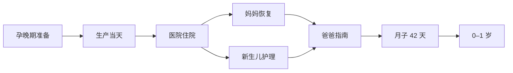

# 模块总览

## 八大模块关系

这八个模块以家庭阶段为主线。妈妈恢复、新生儿护理和爸爸指南会在时间上交叉，使用时应根据实际任务在模块之间跳转，而不是机械地逐卷阅读。

## 内容边界

| 模块 | 核心范围 | 边界说明 |
| --- | --- | --- |
| 第一卷：孕晚期准备 | 孕晚期至临产前的准备工作 | 不承载生产当天的现场流程 |
| 第二卷：生产当天 | 临产开始至宝宝出生 | 不展开住院期间的日常护理 |
| 第三卷：医院住院 | 入院后至出院前的协作与记录 | 不替代医院诊疗方案 |
| 第四卷：妈妈恢复 | 产后妈妈的恢复支持 | 不展开宝宝日常护理 |
| 第五卷：新生儿护理 | 新生儿基础照护与观察 | 不承载妈妈恢复内容 |
| 第六卷：爸爸指南 | 爸爸的协作、沟通和安排 | 不重复其他模块的具体护理流程 |
| 第七卷：月子 42 天 | 产后 42 天逐日 Checklist | 以每日执行和记录为主 |
| 第八卷：0–1 岁 | 宝宝出生后第一年的逐月维护 | 以月龄阶段索引为主 |

## 后续维护方式

1. 先在模块 README 中确认章节范围，再创建或修改业务章节。
2. 新章节必须沿用 `writing-standard.md` 中的统一结构。
3. 涉及医学或育儿事实的内容须在写入前完成来源核验。
4. 每次修改同步更新模块导航；达到发布条件时更新版本历史。
5. 实际家庭记录与通用知识分开维护，避免将个案直接推广为规则。
