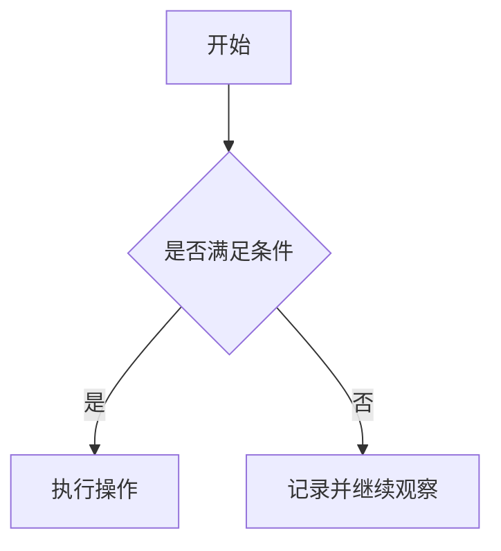

# 写作规范

## Markdown 规范

- Markdown 是项目的唯一源文件格式。
- 文件使用 UTF-8 编码，正文使用中文。
- 段落之间保留一个空行，列表前后保留空行。
- 内部链接使用相对路径，避免依赖本机绝对路径。
- 图片、图表和流程图分别存放在 `assets/` 的对应子目录。
- 业务章节必须保留统一章节结构，不随意删除固定二级标题。

## 文件命名规范

- 目录和普通 Markdown 文件使用英文小写字母、数字和短横线。
- 模块入口统一命名为 `README.md`。
- 日期序号使用两位数字，例如 `day-01.md`。
- 月龄序号使用两位数字，例如 `month-01.md`。
- 不使用空格、下划线、中文文件名或无意义缩写。

## 标题规范

- 每个文件只使用一个一级标题 `#`。
- 固定章节使用二级标题 `##`。
- 三级标题仅用于拆分二级标题下的明确子主题。
- 标题应直接表达内容，不使用装饰性符号或手工编号。

业务章节统一结构：

```markdown
# 标题

## 本章目标

## 为什么重要

## 时间节点

## 操作流程

## 注意事项

## 常见错误

## 医疗风险提醒

## Checklist

- [ ]

## 记录区域
```

## Checklist 规范

- 使用 `- [ ]` 表示未完成事项，使用 `- [x]` 表示已完成事项。
- 每项只描述一个可执行动作。
- 动词放在句首，避免“注意一下”“视情况处理”等含糊表达。
- 需要负责人或完成时间时，在同一项中预留记录字段。

示例：

```markdown
- [ ] 动作：________；负责人：________；完成时间：________
```

## Mermaid 规范

- Mermaid 用于表达阶段关系、判断流程或任务顺序。
- 每张图只表达一个核心流程。
- 节点文字使用简短中文，复杂说明放在图后正文中。
- 节点 ID 使用英文小写字母和数字，避免渲染兼容问题。

示例：



## 表格规范

- 表格必须有表头，列名应能独立说明字段含义。
- 单元格只放简短信息，长段说明移至表格下方。
- 记录模板应预留日期、记录人和备注等必要字段。
- 不用空格模拟表格，不合并单元格。

示例：

| 时间 | 事项 | 记录人 | 备注 |
| --- | --- | --- | --- |
|  |  |  |  |

## 内容边界

- 优先写清时间节点、操作步骤、判断条件、风险提示和记录方式。
- 医疗相关内容必须注明核验来源和适用边界。
- 不复制育儿百科，不编写空泛鼓励，不将个人经验表述为普遍结论。
- 不确定的信息先记录为待核验事项，不直接进入正式业务正文。
